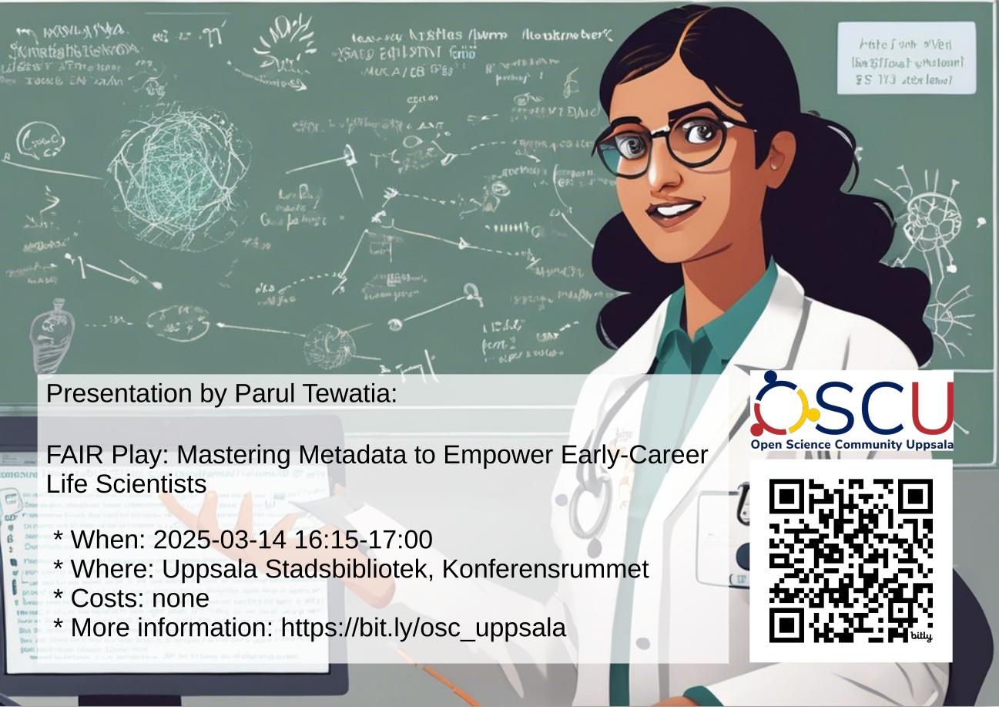

# Activities

We usually have a speaker at the second Friday of the month,
see schedule below.

When                      | Where                   |What
--------------------------|-------------------------|-----------------------------------------------------------------------------------------------------------------
2025-04-03 13:00-14:00    |Online                   |[PLOS and SciLifeLab Webinar: Navigating Open Science Policies – Practical Guidance for Researchers on Sharing Data and Software](https://www.scilifelab.se/event/plos-and-scilifelab-webinar-navigating-open-science-policies-practical-guidance-for-researchers-on-sharing-data-and-software/)
2025-04-11 16:15-17:00    |USB [1], Konferensrummet |[Joanna Sendecka, 'Fear-not Open Science - tackling challenges in sharing your research'](20250411_joanna_sendecka/README.md)
2025-04-22 10:00-11:00    |Online                   |[Webinar '“It just works with my software” – How to adopt the FAIR principles in life science research at any career stage'](https://www.scilifelab.se/event/datamanagement-fair-principles/)
2025-05-09 16:15-17:00    |USB [1], Konferensrummet |Rafael Ahlskog, 'Working with pre-registrations when using register data'
2025-09-12 16:15-17:00    |?USB [1], Konferensrummet|Jonas Söderberg, TBA
2025-10-10 16:15-17:00    |?USB [1], Konferensrummet|Empty slot
2025-11-14 16:15-17:00    |?USB [1], Konferensrummet|?Elin Kronander
2025-12-12 16:15-17:00    |?USB [1], Konferensrummet|Empty slot

- See ['past events'](past_events.md) for our past activities.
- [1] [Uppsala Stadsbibliotek](https://bibliotekuppsala.se/web/arena/stadsbiblioteket#/), Svartbäcksgatan 17, 753 75 Uppsala,
  see ['where'](where.md) for a map
- [2] [Puben](https://pubenuppsala.se/), S:t Olofsgatan 9, 753 21, Uppsala
