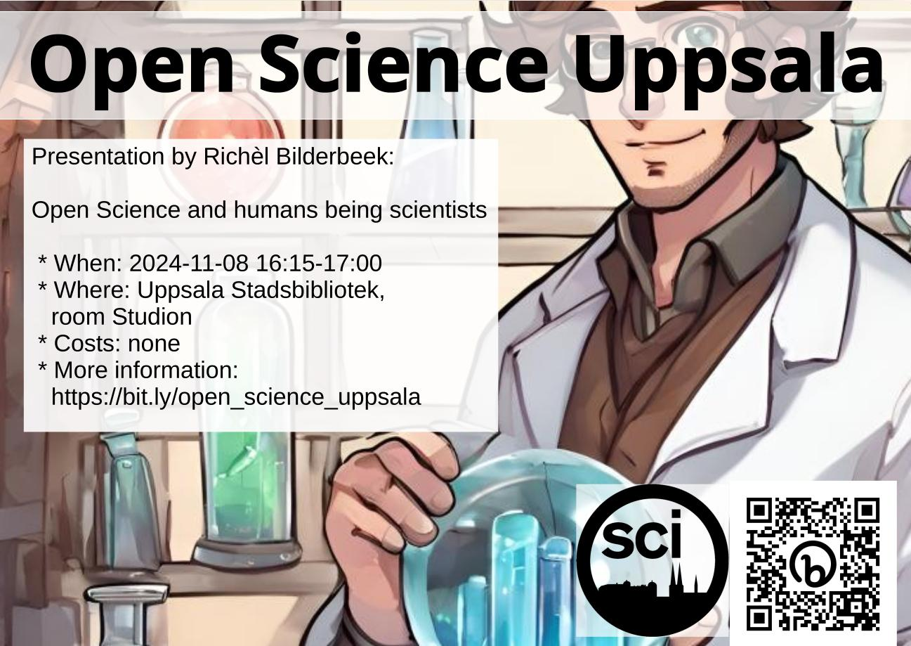

# 2024-11-08 Richel Bilderbeek: 'Open Science and humans being scientists'

* Speaker: Richel Bilderbeek
* Title: Open Science and humans being scientists

## USB

* Studion
* Språk: Engelska
* Ålder/Målgrupp: 8-88
* Samarrangör: Open Science Uppsala
* Anmälan: nej
* Bild av ansikte: -
* Fotografens namn av ansikte: -
* Fotografens namn av bakgrundsbild: ingen, bild är [CC0](https://en.wikipedia.org/wiki/Creative_Commons_license#Zero_/_public_domain)

### 🇸🇪 Kort text

Fredag 8:e November 16.15-17.00 OSU hälsar Richel Bilderbeek
med föredrag 'Open Science and humans being scientists'.
Fler info på <https://bit.ly/osc_uppsala>

### 🇬🇧 Short text

Friday 8th November 2023 16:15-17:00, OSU welcomes Richel Bilderbeek
with his presentation 'Open Science and humans being scientists'.
More info at <https://bit.ly/osc_uppsala>

### 🇸🇪 Längre text

Europeiska unionen tycker att öppen vetenskap är viktig. En av aspekterna av dess strategiska plan är medborgarvetenskap, som använder icke-vetenskapsmän i forskning. Det här föredraget kommer att handla om medborgarvetenskap: varför är medborgarvetenskap viktig? Vad är dess inverkan? Vilka bevis har vi för detta? Och naturligtvis: var och hur kan en vanlig medborgare hjälpa till?

### 🇬🇧 Longer text

The European Union thinks Open Science is important. One of the facets of its strategic plan is citizen science, which is using non-scientists in research. This talk will be about citizen science: why is citizen science important? What is its impact? What evidence do we have for this? And of course: where and how can a regular citizen help?

