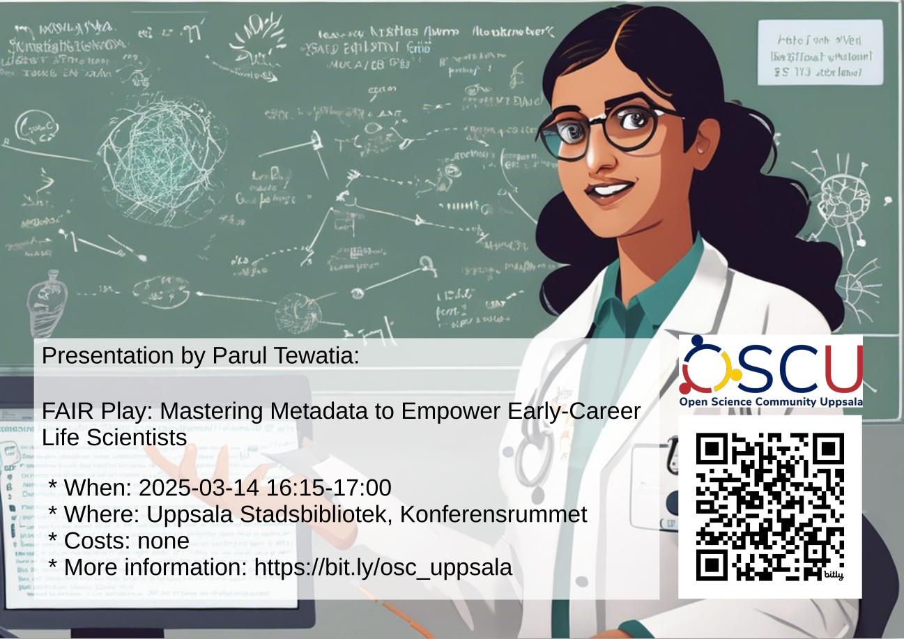

# 2025-03-14: Parul Tewatia: 'FAIR Play: Mastering Metadata to Empower Early-Career Life Scientists'

- Speaker: Parul Tewatia
- Title: FAIR Play: Mastering Metadata to Empower Early-Career Life Scientists

Unlock the potential of your research by mastering meta(data) management in
and the FAIR Data Principles—Findable, Accessible, Interoperable, and Reusable.
This session offers practical guidance tailored for early-career life
scientists, focusing on best practices to organise and share your data
effectively. The talk will focus on how good metadata practices can enhance
collaboration, ensure reproducibility, and align your work with Open Science
principles, ultimately increasing the impact of your research.
