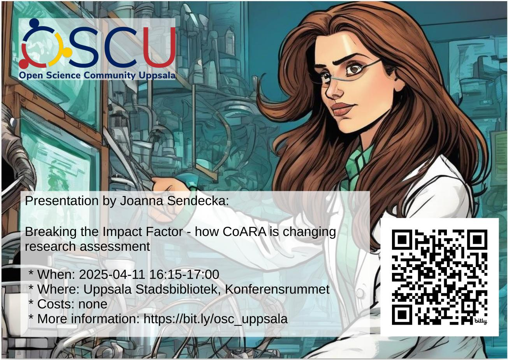

# 2025-04-14: Joanna Sendecka, 'Breaking the Impact Factor - how CoARA is changing research assessment'

- Date: 2025-04-14
- Speaker: Joanna Sendecka
- Title: Breaking the Impact Factor - how CoARA is changing research assessment

## Description

As more and more researchers spoke out about the flaws of using the h-index to assess academic performance, several international movements raised. The most recent—and the biggest so far—is CoARA, the Coalition for Advancing Research Assessment.

Sweden is one of 18 countries with an active national chapter and has five working groups tackling different aspects of reform.

So, what are they up to? And what might the future of research assessment actually look like? Let’s dive in and find out.
