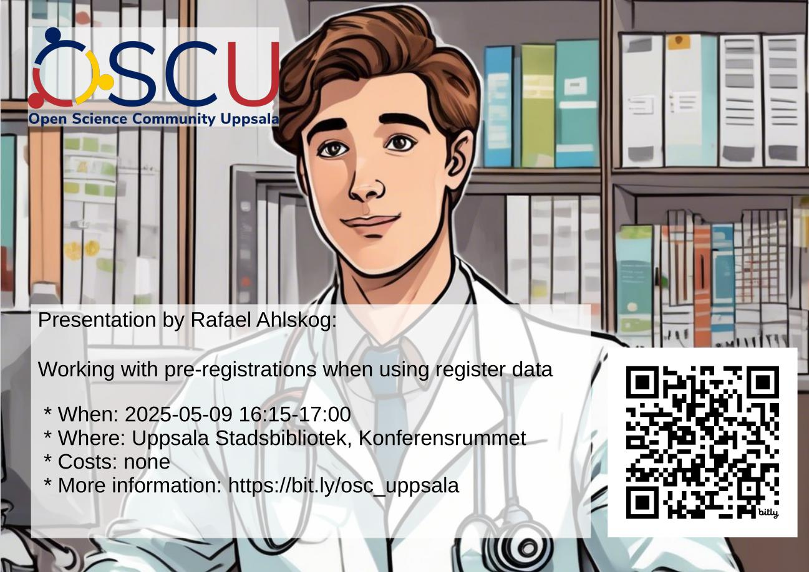

# Rafael Ahlskog: 'Working with pre-registrations when using register data'

- When: 2025-05-09 16:15-17:00
- Where: USB [1], Konferensrummet
- Who: Rafael Ahlskog
- Title: 'Working with pre-registrations when using register data'

- Presentation slides:
    - [Slides](Pre-reg_with_register_data.pdf)
    - [Handout](Pre-reg_with_register_data_handout.pdf)

Talk description:

Preregistered analyses have been one of the major proposed solutions to the
problem of "questionable research practices" like p-hacking and HARKing.
This solution works because ideally, we then commit to a specific set of
analyses before data is even gathered. However - in many cases, researchers
have to rely on data that has already been gathered by someone else. This
inherently compromises the "data blindness" that we are supposed to have when
writing up our preregistration. Is there still a way that preregistrations
could be useful? How should we think about data blinding when the data is
already out there?
