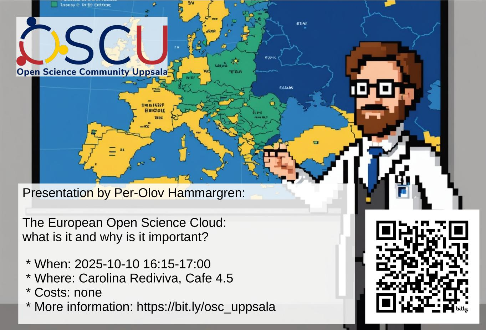

# 2025-10-10 Per-Olov Hammargren: The European Open Science Cloud: what is it and why is it important?

- Who: Per-Olov Hammargren
- Title: The European Open Science Cloud: what is it and why is it important?
- When: 2025-10-10 16:15-17:00
- Where: [Carolina Rediviva](https://link.mazemap.com/90ZtnxI3), Cafe 4.5

## Talk description

The European Open Science Cloud is a EU funded infrastructure
to help Open Science, that has been under development since 2015.
This talk will discuss the goal of EOSC, how it helps doing Open Science,
as well as the current state.
The goal of this talk is to help you decide whether to (now/later)
use EOSC in your Open Science activities.
