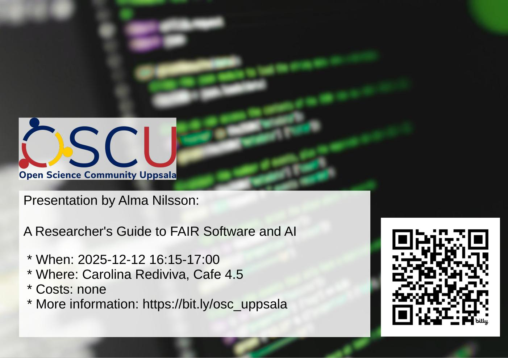

# 2025-12-12 Alma Nilsson: A Researcher's Guide to FAIR Software and AI

- Who: Alma Nilsson
- Title: A Researcher's Guide to FAIR Software and AI
- When: 2025-12-12 16:15-17:00
- Where: [Carolina Rediviva](https://link.mazemap.com/90ZtnxI3), Cafe 4.5

## Talk description

This talk introduces what FAIR means for research software and AI, why openness matters, and how researchers can make their code and models more aligned with best practices. It covers practical steps for sharing code, based on the SciLifeLab Open Software Checklist, and additional considerations for machine learning artefacts.

