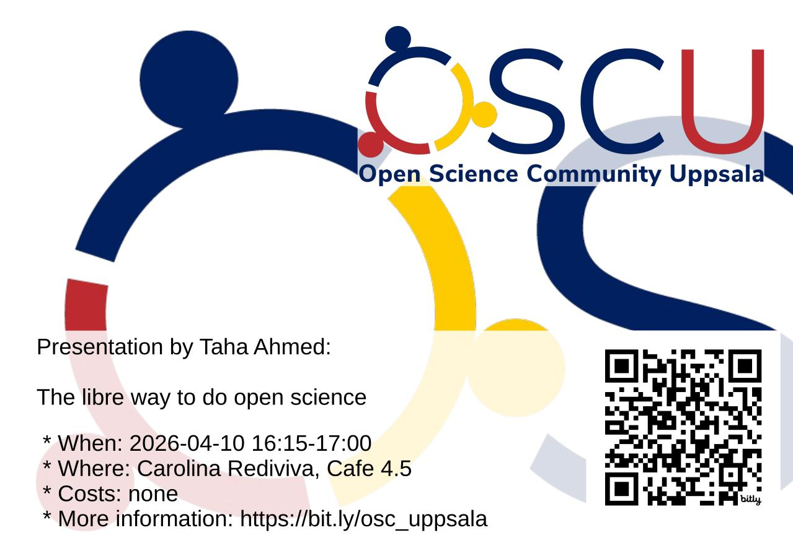

# 2026-04-10 Taha Ahmed: The libre way to do open science

- Who: Taha Ahmed [homepage](http://solarchemist.se/)
- Title: The libre way to do open science
- When: 2026-04-19 16:15-17:00
- Where: [Carolina Rediviva](https://link.mazemap.com/90ZtnxI3), Cafe 4.5
  ([detailed route](https://open-science-community-uppsala.github.io/open_science_community_uppsala/where/))

## Talk description

In this talk we will ponder together to which extent
you are able to use libre software and libre infrastructure
today as a researcher.
I will give lots of helpful examples, and also touch on
how to share your own digital research artefacts
(code, software, data) using free and libre services.
