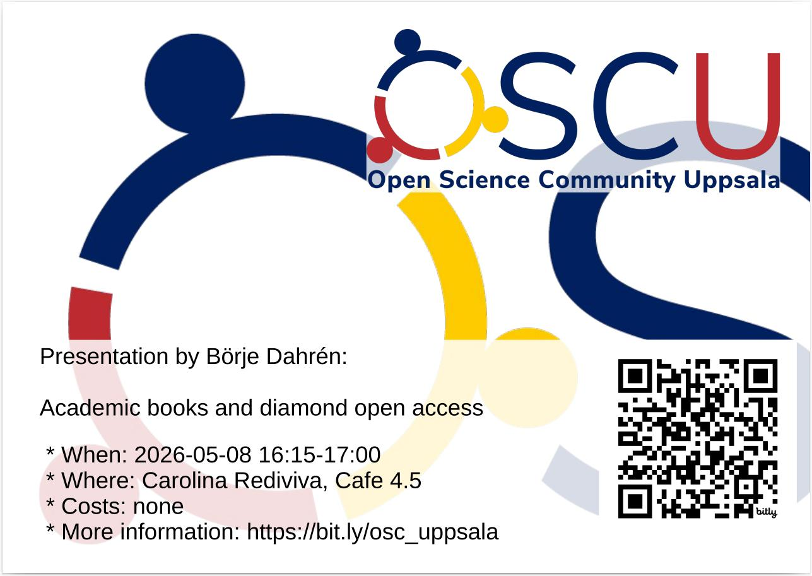

# 2026-05-08 Börje Dahrén: 'Academic books and diamond open access'

- Who: Börje Dahrén
- Title: Academic books and diamond open access
- When: 2026-05-08 16:15-17:00
- Where: [Carolina Rediviva](https://link.mazemap.com/90ZtnxI3), Cafe 4.5
  ([detailed route](https://open-science-community-uppsala.github.io/open_science_community_uppsala/where/))

## Talk description

The open science transition is largely geared towards the STEM subjects and optimised for shorter format publication formats such as the journal article. In contrast, the open access publishing landscape for the humanities/social sciences in general and for books in particular is relatively speaking both underfunded and underdeveloped. This talk will focus on the existing small scale and researcher-led book publishing initiatives, and how these can be nurtured and and optimised for the diamond OA publishing model.
