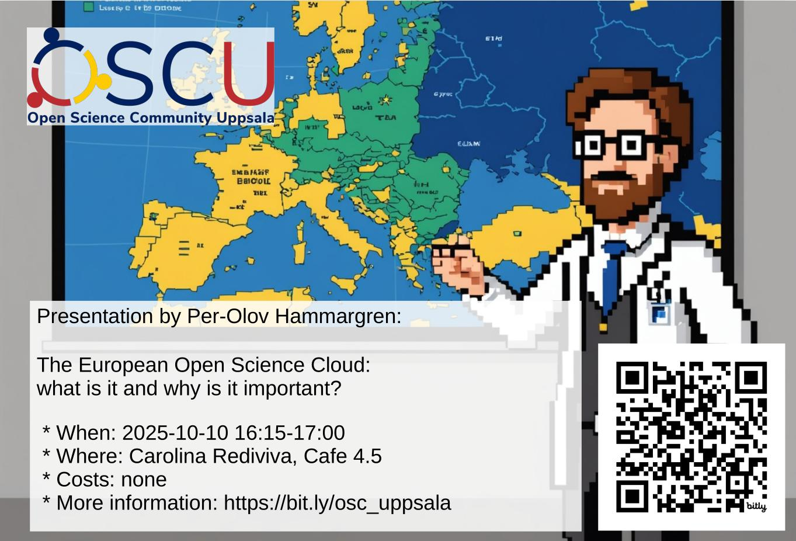

# Activities

We usually have a speaker at the second Friday of the month,
see schedule below.

!!! info "Our next event"

    

When (CEST)               | Where                  |What
--------------------------|------------------------|-----------------------------------------------------------------------------------------------------------------
2025-10-10 16:15-17:00    |CR [1], Café 4.5        |[Per-Olov Hammargren: The European Open Science Cloud: what is it and why is it important?](20251010_per_olov_hammargren/README.md)
2025-11-14 16:15-17:00    |CR [1], Café 4.5        |?Elin Kronander
2025-12-12 16:15-17:00    |CR [1], Café 4.5        |Alma Nilsson, TBA

- See ['past events'](past_events.md) for our past activities.
- [1] [Carolina Rediviva](https://link.mazemap.com/90ZtnxI3), Uppsala,
  see ['where'](../where.md) for a map
