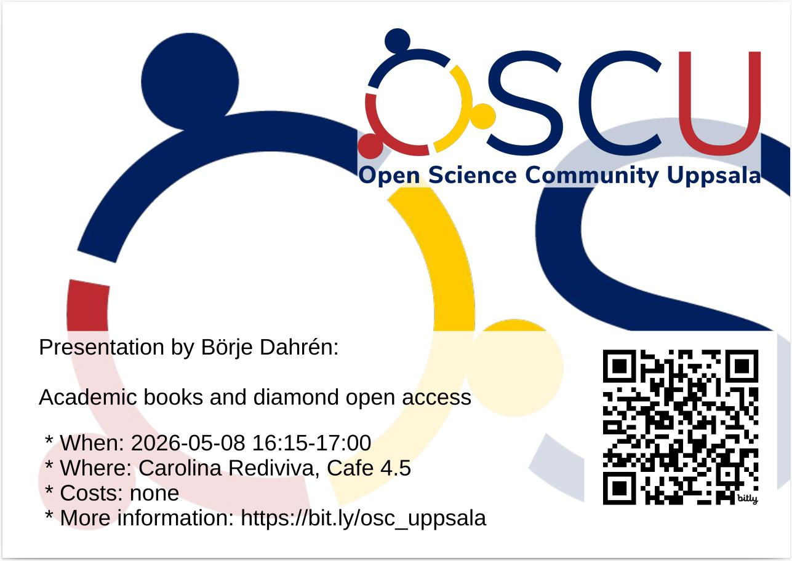

# Activities

We usually have a speaker at the second Friday of the month,
see schedule below.

!!! info "Our next event"

    

When (CEST)               | Where [`3`]             |What
--------------------------|-------------------------|-----------------------------------------------------------------------------------------------------------------
.                         |.                        |Summer holiday
2026-09-08 11:00-12:00    |Online                   |[SciLifeLab OpenRefine workshop](https://www.scilifelab.se/event/openscience-openrefine/)
2026-09-11 16:15-17:00    |CR `[1]`, Café 4.5       |Maria Vrettou, TBA
2026-10-09 16:15-17:00    |CR `[1]`, Café 4.5       |`[Empty slot]`
2026-11-13 16:15-17:00    |CR `[1]`, Café 4.5       |`[Empty slot]`
2026-12-11 16:15-17:00    |CR `[1]`, Café 4.5       |`[Empty slot]`

- See ['past events'](past_events.md) for our past activities.
- `[1]` [Carolina Rediviva](https://link.mazemap.com/90ZtnxI3), Uppsala,
  see ['where'](../where.md) for a map
- `[2]` This is the second Friday of the month, after the Christmas holiday
- `[3]` the two capitals denote the host, e.g. `BD` is Börje Dahrén,
  `JE` is Jens Eriksson

