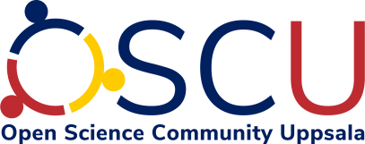

# Open Science Community Uppsala

Welcome to the homepage of Open Science Community Uppsala,
the local Open Science community in Uppsala.

Open Science is the application of the scientific method
in the most transparent way possible,
such as Open Access papers, Open (and FAIR) Data,
Open Code, open peer-review, preregistration and registered reports,
resulting in research that is (more likely to be) reproducible.

This group discusses the pros and cons of Open Science
by means of discussing papers and inviting speakers.

- [What is Open Science Community Uppsala?](what.md)
- [How to follow Open Science Community Uppsala](follow.md)
- [Events](events/events.md)
- [Past events](events/past_events.md)
- [FAQ](faq.md)

---

