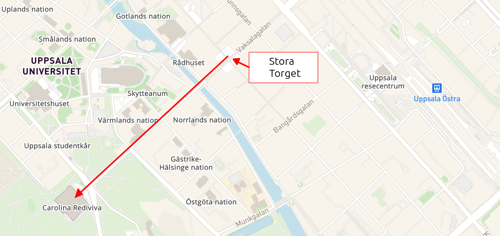
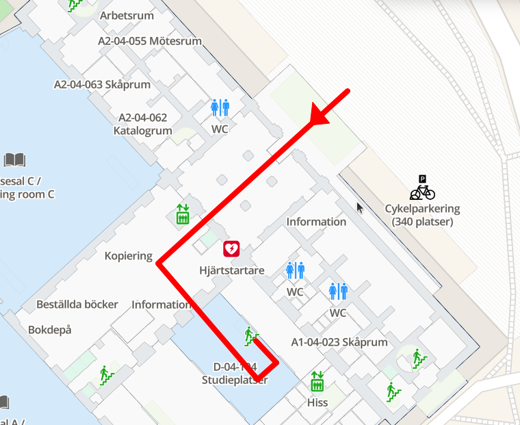
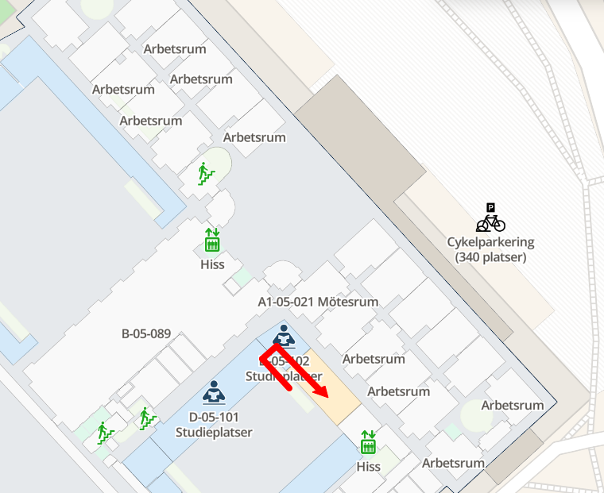
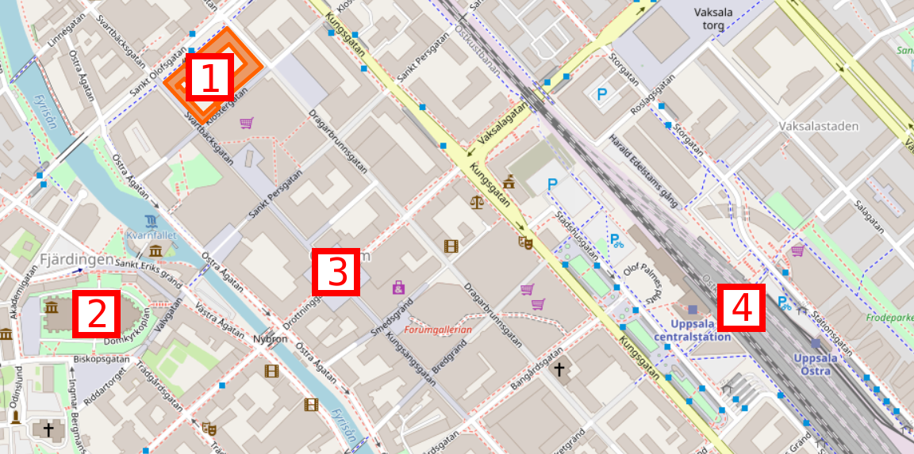
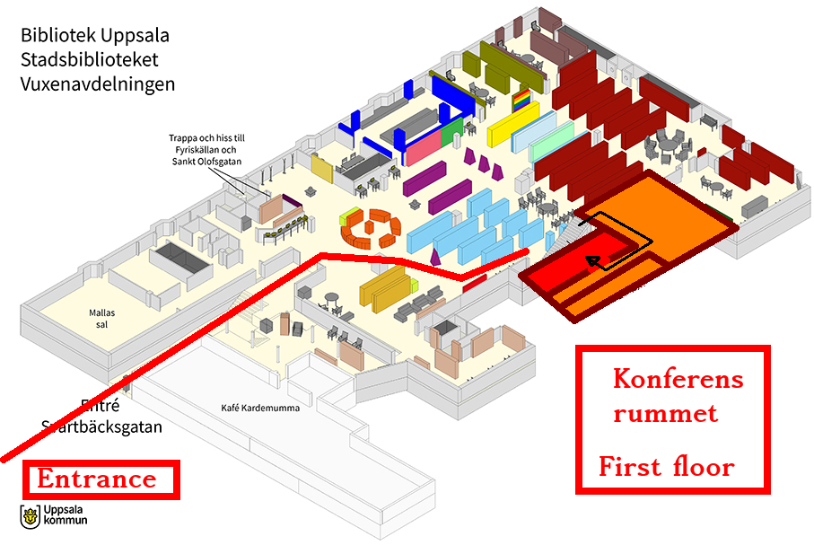
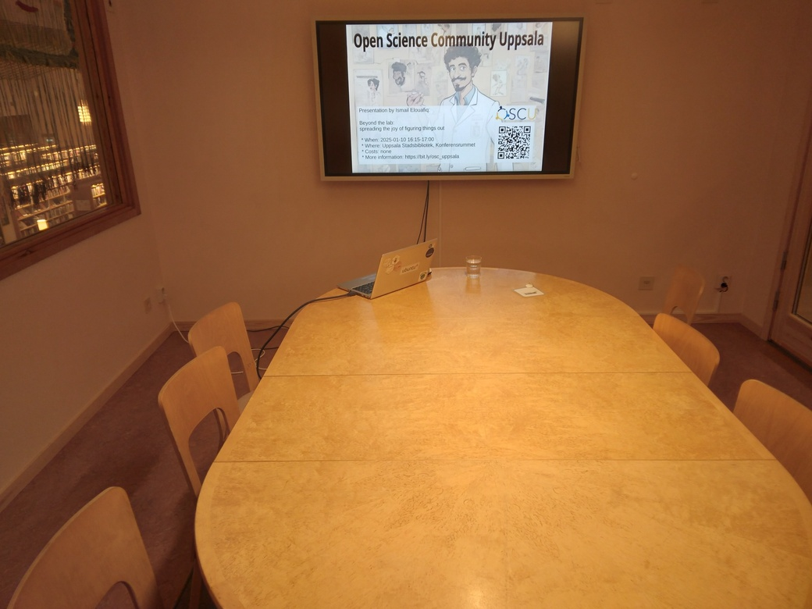

# Where

Our events are at
[Carolina Rediviva, room Café 4.5](https://link.mazemap.com/90ZtnxI3),
Drottninggatan, 751 20 Uppsala:

> Map of Uppsala

> Here is where to get into Carolina Rediviva
> and take a stairs up.

> On floor up, here is where we are:
[room Café 4.5](https://link.mazemap.com/90ZtnxI3).

???- question "What was the previous location?"

    Our past events were at [Uppsala Stadsbibliotek](https://bibliotekuppsala.se/web/arena/stadsbiblioteket#/),
    Svartbäcksgatan 17, 753 75 Uppsala:

    

    > Map, from [OpenStreetMap](https://www.openstreetmap.org/way/98942846).
    > We are at 1.
    >
    > 1. Uppsala Stadsbibliotek, Svartbäcksgatan 17
    > 2. Domkyrkan
    > 3. Stora torget
    > 4. Uppsala Central Station

    

    > The ground floor of Uppsala Stadsbibliotek. We are in the room called 'Konferensrummet'

    

    > Konferensrummet
